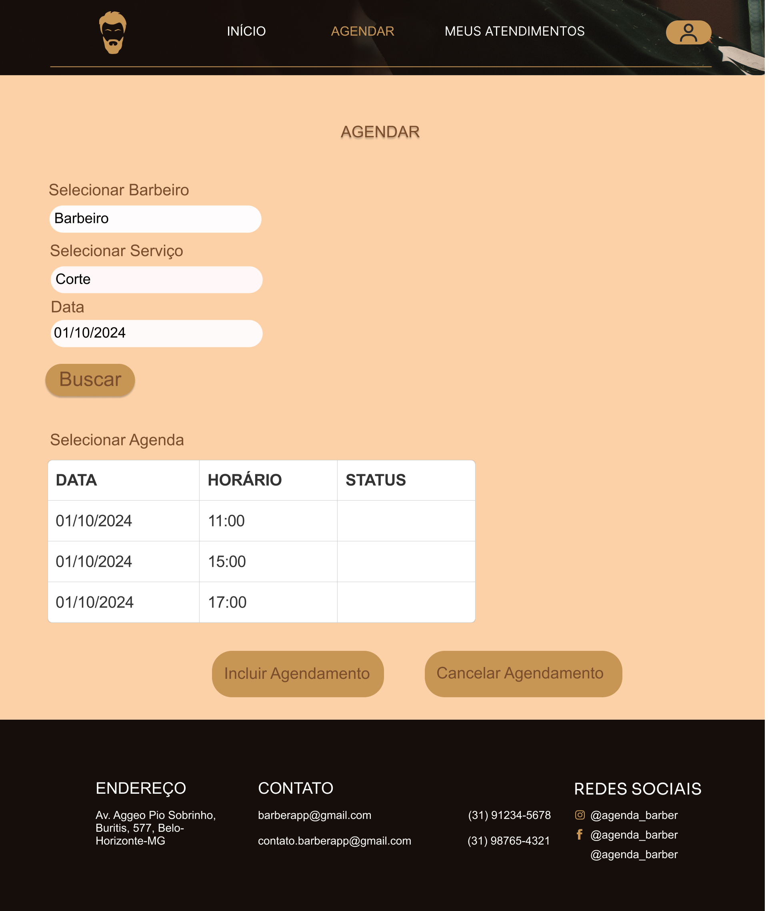
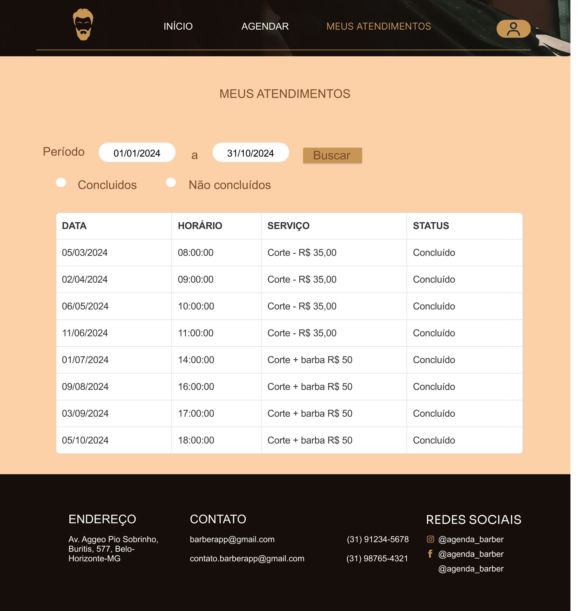
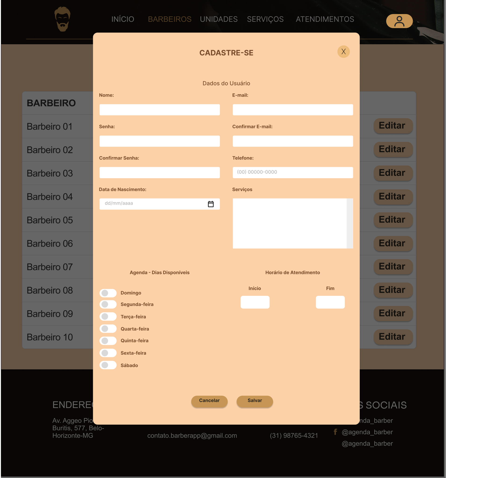
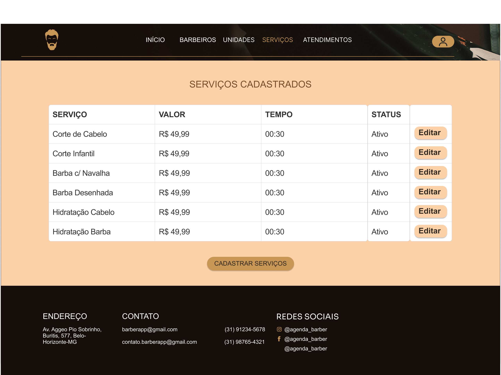
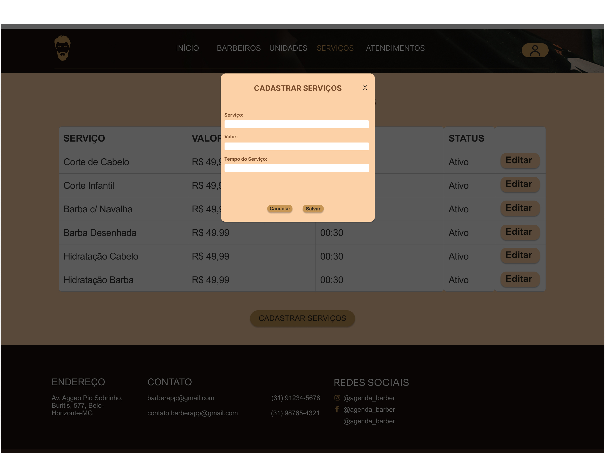
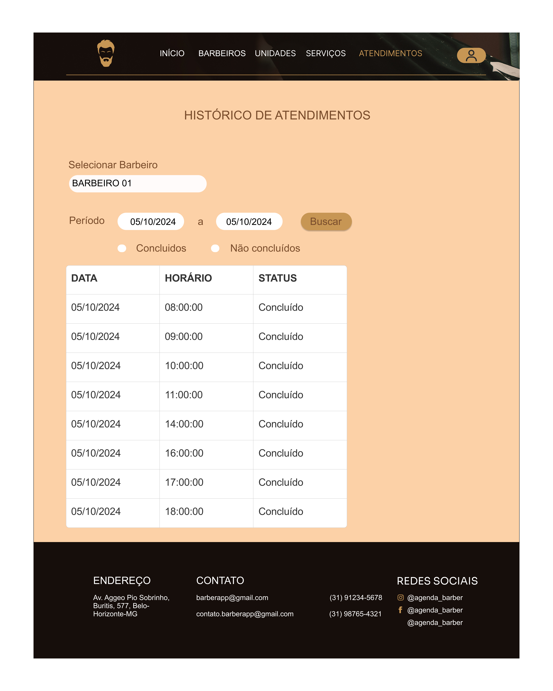

# Projeto de Interface

Pré-requisitos: <a href="2-Especificação do Projeto.md"> Documentação de Especificação</a>

Visão geral da interação do usuário pelas telas do sistema e protótipo interativo das telas com as funcionalidades que fazem parte do sistema (wireframes).

 Apresente as principais interfaces da plataforma. Discuta como ela foi elaborada de forma a atender os requisitos funcionais, não funcionais e histórias de usuário abordados nas <a href="2-Especificação do Projeto.md"> Documentação de Especificação</a>.

## User Flow

Fluxo de usuário (User Flow) é uma técnica que permite ao desenvolvedor mapear todo fluxo de telas do site ou app. Essa técnica funciona para alinhar os caminhos e as possíveis ações que o usuário pode fazer junto com os membros de sua equipe.

> **Links Úteis**:
> - [User Flow: O Quê É e Como Fazer?](https://medium.com/7bits/fluxo-de-usu%C3%A1rio-user-flow-o-que-%C3%A9-como-fazer-79d965872534)
> - [User Flow vs Site Maps](http://designr.com.br/sitemap-e-user-flow-quais-as-diferencas-e-quando-usar-cada-um/)
> - [Top 25 User Flow Tools & Templates for Smooth](https://www.mockplus.com/blog/post/user-flow-tools)

## Wireframes

### Home
Esta é a página inicial, na qual serão destacadas nossa história , nossos serviços e feedbacks. Inclui o menu de navegação, opção de cadastro, informações sobre produtos.

### Home Entrar
Tela home com pop-up de entrar.

### Home Sair
Tela home com pop-up de sair.

### Cadastro Usuário Cliente
Tela de Cadastro de novo usuário.

### Acesso Cliente - Agendamento 
Tela dedicada para o usuário realizar o agendamento. 

### Acesso Cliente - Meus Agendamentos - Histórico
O cliente tem a opção de verificar o histórico de serviços que consumiu na barbearia. 

### Acesso Barbeiro - Minha Agenda
O barbeiro consegue acompanhar sua agenda de atendimentos tendo a possibilidade de incluir ou cancelar o agendamento.

### Acesso Barbeiro - Históricos de Atendimentos
O barbeiro tem a opção de verificar o histórico dos seus atendimentos.

### Acesso Administrador - Barbeiros Cadastrados
O Administrador pode visualizar os profissionais que prestão serviço na barbearia.

### Acesso Administrador - Cadastrar Novos Barbeiros
O Administrador pode efetuar o cadastro de novos profissionais.

### Acesso Administrador - Unidades Cadastradas
O Administrador consegue visualizar unidades.

### Unidades - Cadastrar Novas Unidades
O Administrador consegue cadastrar novas unidades.

### Acesso Administrador - Serviços Cadastrados
O Administrador consegue visualizar serviços cadastrados.

### Acesso Administrador - Cadastrar Novos Serviços
O Administrador consegue cadastrar novos serviços cadastrados.

### Acesso Administrador - Acompanhar Agenda
O Administrador consegue acompanhar a agenda de um barbeiro.

### Acesso Administrador - Acompanhar Histórico de Atendimentos
O Administrador consegue acompanhar o histórico de atendimentos de um barbeiro.

São protótipos usados em design de interface para sugerir a estrutura de um site web e seu relacionamentos entre suas páginas. Um wireframe web é uma ilustração semelhante do layout de elementos fundamentais na interface.
 
> **Links Úteis**:
> - [Protótipos vs Wireframes](https://www.nngroup.com/videos/prototypes-vs-wireframes-ux-projects/)
> - [Ferramentas de Wireframes](https://rockcontent.com/blog/wireframes/)
> - [MarvelApp](https://marvelapp.com/developers/documentation/tutorials/)
> - [Figma](https://www.figma.com/)
> - [Adobe XD](https://www.adobe.com/br/products/xd.html#scroll)
> - [Axure](https://www.axure.com/edu) (Licença Educacional)
> - [InvisionApp](https://www.invisionapp.com/) (Licença Educacional)
