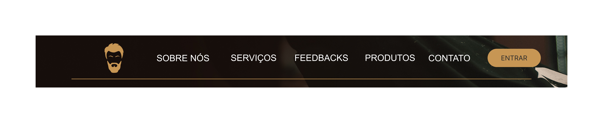
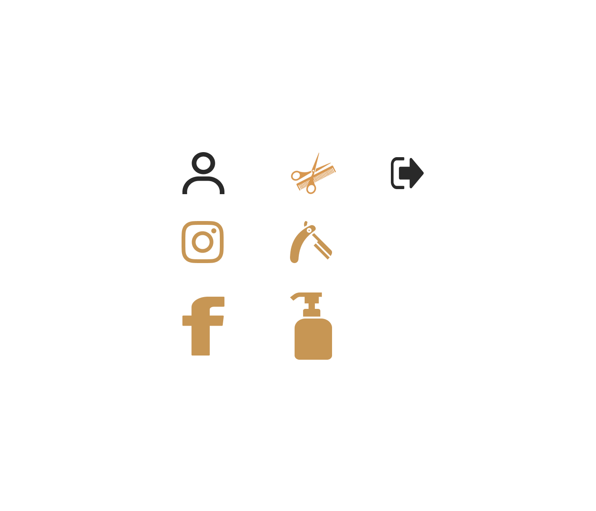

# Template padrão do site

No site Zé Barber, estamos priorizando a acessibilidade e praticidade para os clientes e barbeiros de várias maneiras. Utilizamos um design simplificado com botões intuitivos, formulários e pop-ups. Também utilizamos imagens estáticas que contribuem para o conteúdo visual do site. Nosso objetivo é criar uma aplicação web para suprir as necessidades de uma barbearia e auxiliar na gestão dos atendimentos, contribuindo para uma melhor experiência do cliente.

## Design

### Logo
Logo do Site

### Cabeçalho
Cabeçalho do site

### Footer
Rodapé do site

### Home
Página inicial

__________________________________________________

## Cores
Paleta de cores utilizadas

__________________________________________________

## Tipografia

A fonte Arial é uma ótima escolha para sites devido à sua excelente legibilidade em diferentes dispositivos e tamanhos de tela. Ela transmite uma imagem profissional e contemporânea.

## Iconografia

Os ícones do [Icos-Icons]([https://fonts.google.com/icons](https://icon-icons.com/pt/)) possui alta facilidade de iplementação trazendo um design inovador para o site, com bastante variedade de ícones.

Ícones usados: 

Pré-requisitos: <a href="2-Especificação do Projeto.md"> Especificação do Projeto</a>, <a href="3-Projeto de Interface.md"> Projeto de Interface</a>, <a href="4-Metodologia.md"> Metodologia</a>

Layout padrão do site (HTML e CSS) que será utilizado em todas as páginas com a definição de identidade visual, aspectos de responsividade e iconografia.

> **Links Úteis**:
>
> - [CSS Website Layout (W3Schools)](https://www.w3schools.com/css/css_website_layout.asp)
> - [Website Page Layouts](http://www.cellbiol.com/bioinformatics_web_development/chapter-3-your-first-web-page-learning-html-and-css/website-page-layouts/)
> - [Perfect Liquid Layout](https://matthewjamestaylor.com/perfect-liquid-layouts)
> - [How and Why Icons Improve Your Web Design](https://usabilla.com/blog/how-and-why-icons-improve-you-web-design/)
